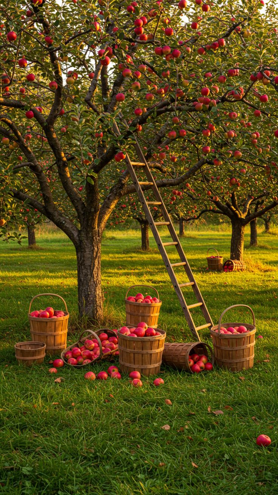

# IDEA9103_MainProject_zoli0682

## Instructions

Taps the "S" on the keyboard, a random fruit will drop

## Drive Part

I'm mainly responsible for the **interaction** part

## Image Animated

The semiCircle(fruit) part of the image will be animated. When the user taps the "S" on the keyboard, a random fruit will drop

## References Inspiration

 
My inspiration mainly comes from this picture, which inspires me to think: **Can users be allowed to control the falling process of the fruit independently?** When all the fruits fall one after another, leaving only the branches and lines, the picture will naturally convey an emotional change from **harvest to decline**, creating a dynamic sense of time and life.

## Technical explanation

I add the velocity, gravity, boudness and minimunSpeed attributes which related to speed in the SemiCircle class, also added a drop function in the SemiCircle class, when the user presses the "S" key, The speed of the fruit will be superimposed by gravity over time, and the fruit will also move along the Y-axis with the speed. When the fruit hits the boundary, the speed will be multiplied by the boundness (<1) to achieve the purpose of speed attenuation. At the same time, it will be judged that if the value of the speed is less than the set minimum speed, it means that this speed can no longer meet the basic motion, and the fruit will be stopped
