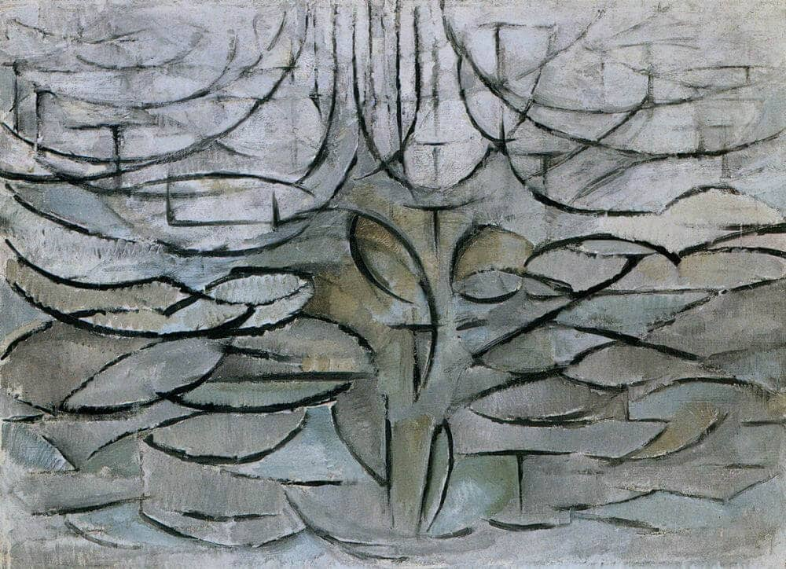
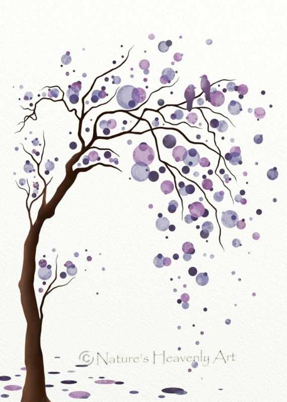
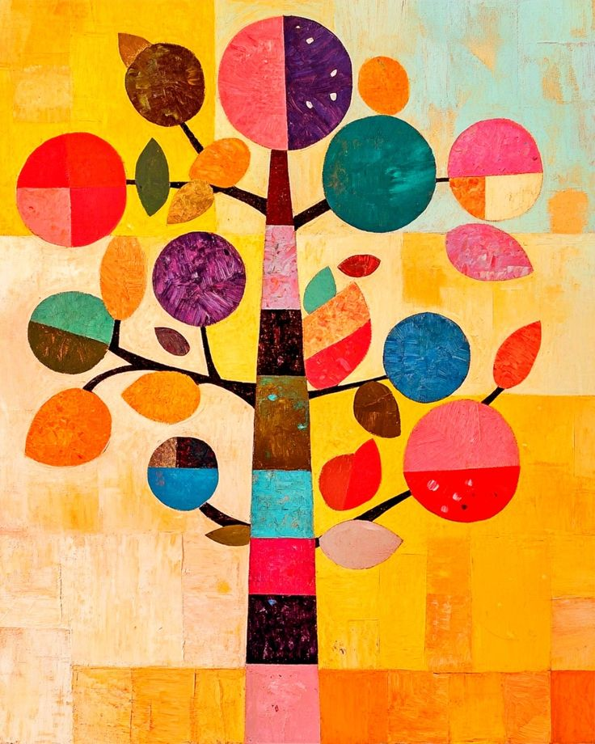
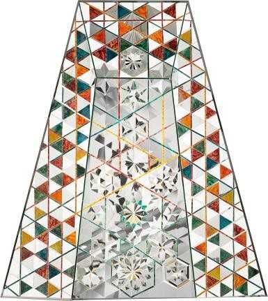

<<<<<<< HEAD
<<<<<<< HEAD

# Anwar Jalal Shemza: Apple Tree

# 

=======

> > > > > > > 60a96cb46abc2b11374f0df3d939dff4e238f5d7
> > > > > > > // Add new image of apple tree

# Anwar Jalal Shemza Apple Tree

// Add new image of apple tree

# Flowering-apple-tree pic

<<<<<<< HEAD
<<<<<<< HEAD
//This is the Piet Mondrian artwork in which shows tree branches growing in a disodered way. Compared with the image of the rational-look Anwar Jalal Shemza Apple Tree image, it shows a different way of vivid and tension of nature life.

> > > > > > > # 0661961d7c4f2a1b7e3f483ea49576d3b38a76d3
> > > > > > >
> > > > > > > //This is the Piet Mondrian artwork in which shows tree branches growing in a disodered way. Compared with the image of the rational-look Anwar Jalal Shemza Apple Tree image, it shows a different way of vivid and tension of nature life.
> > > > > > > 0661961d7c4f2a1b7e3f483ea49576d3b38a76d3

// Idea of animation

### Round apples appear first in dots, and the lines expand from the center, stretching like branches and gradually forming a whole tree.

### Let the apples rotate around the branch and grow upward.

=======
//This is the Piet Mondrian artwork in which shows tree branches growing in a disodered way. Compared with the image of the rational-look Anwar Jalal Shemza Apple Tree image, it shows a different way of vivid and tension of nature life.

# Idea of animation

### Round apples appear first in dots, and the lines expand from the center, stretching like branches and gradually forming a whole tree.

### Let the apples rotate around the branch and grow upward.

> > > > > > > 60a96cb46abc2b11374f0df3d939dff4e238f5d7

### Apples are scattered.

 
This picture is very similar to the style we chose. The fruits or leaves are all composed of circles. The circles in the second picture present a kind of drifting action. I think in our works, we can try to make natural actions such as apples falling and rolling.

### Present the state of plants with different colors

 
This picture uses different color blocks to represent the changes throughout a tree's life, so I think we can also use different color blocks to represent the life of an apple tree
### Apple-shaped variant

This work by Iranian mirror mosaic artist Monir Shahroudy Farmanfarmaian consists of abstract geometric compositions fused with traditional Persian design structures, which is similar to our chosen artwork, Shemza's Apple Trees, as Shemza also combines Islamic calligraphic structures with geometric compositions, and the polygons and circles expressed by Monir are also similar in meaning and are ideal for visual transformation. The polygonal shape of the monir is also similar to the circle, making it a perfect visual translation.