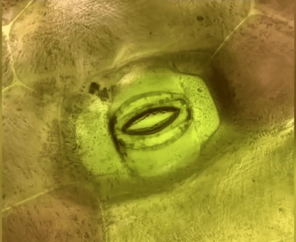
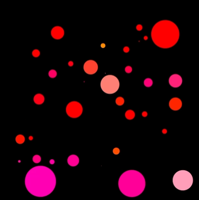

# IDEA9103_MainProject_kche0637
## Instructions
Clicking the play/pause button controls the music. When playing, the circle representing the apple dynamically scales up and down based on the amplitude of the music. When paused, both the music and the movement of the apple-representing circle stop.
## Drive Part
I chose **audio** to drive my personal code
## Image Animated
In my animation, each circle will dance along with the music, imitating a kind of "breathing" effect. The amplitude of the music controls the scaling factor, causing the circle to randomly increase or decrease within a definite range (0.5 to 2.5), with a probability of approximately 5% per frame. This creates a subtle and organic sense of movement, similar to the rhythm of a living being's breathing.
My animation is an interactive effect using music-driven animation, as opposed to the other group members' animations that consisted of keyboard input, time-based rotational periodic motion, and transparency through time changes. This part of me visualized the changes in the music so that the interface produced visual feedback synchronized with the rhythm of the sound. A keyboard R key was also set to reset the original state.
## References Inspiration
 
 
I was inspired by the first GIF with the rhythmic effect of plant cells "breathing", and the second GIF with the changing circle, and I thought of the "apple tree" as a symbol of life. Therefore, I tried to express a visual feeling of vitality, breathing and growing by changing the size of the abstract circle. For the music, I chose "Reflections (1111 Hz)" by Malte Marten. The rhythm of the drums is similar to that of breathing, which is very suitable for the interactive atmosphere I wanted to convey. As the music plays, the circles representing apples start to move: they continue to zoom in and out according to the rhythm of the drums, creating a visual sense of "breathing" and growing life.
## Technical explanation
This part of my code uses p5.Amplitude to obtain the real-time volume level of the music being played. I mapped the amplitude value to a scaling range of 0.5 to 2.5. Each semi-circle has approximately a 5% probability of resizing according to the amplitude per frame and adding randomness to make the animation more natural and unpredictable. This method simulates the natural breathing rhythm and better reinforces the core concept of my design. This method makes use of p5.Amplitude, which is a standard sound analysis tool provided by p5.js.

The inspiration for this technology comes from Daniel Shiffman's amplitude analysis tutorial[Amplitude Analysis - p5.js Sound Tutorial](https://www.youtube.com/watch?v=NCCHQwNAN6Y&t=244s), which demonstrates how to use p5.Amplitude() to map the sound level to the size of visual elements. In addition, the p5.Amplitude reference documentation also provides references for my study[p5.Amplitude](https://p5js.org/reference/p5.sound/p5.Amplitude/?utm_source=chatgpt.com).
